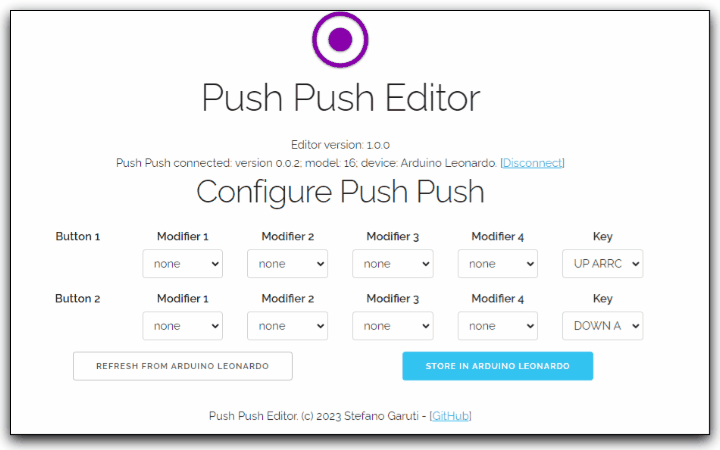

#  Push Push

Push Push is a very easy to build device (based on Arduino) that provides you with a number of buttons (or pedals) that can send keystrokes combinations to your computer.

While you can find a lot of similar DIY project on the web, Push Push is pretty unique because it can be configured to send keystrokes of your choice with it's own [editor](https://garubi.github.io/push-push-editor/), without the need to change the firmware code e withaout the need of Arduino compiler.
Simply connect it to the [editor](https://garubi.github.io/push-push-editor/) and configure your Push Push.



# How to build it

## The hardware 

## The software

## The configuration

# References

## MIDI sysex implementation for configuration

The communication between Push Push and the editor is based on the MIDI protocol, exchanging System Exclusive Messages.

While you can send the sysex message with any software that can send system exclusive, I recommend using the dedicated editor here: (https://garubi.github.io/push-push-editor/)

```
            IDENTIFIER        MESSAGE_TYPE   ACTION   CONTENT_TYPE       
F0 X_MANID1 X_MANID2 X_PRODID [REQ, REPL] [ GET, SET ]   [...]           F7

const uint8_t X_MANID1 = 0x37; // Manufacturer ID 1  (UBIStage)
const uint8_t X_MANID2 = 0x72; // Manufacturer ID 2  (UBIStage)
const uint8_t X_PRODID = 0x10; // Product ID (Push Push)

const uint8_t X_MODELID = 0x10; // Model ID (Specific Push Push implementations: num of buttons etc)

const byte VERSION_MAJOR = 1;
const byte VERION_MINOR = 0;
const byte VERSION_PATCH = 0;

const byte REQ = 0x00; // Request
const byte REP = 0x01; // Replay

const byte GET = 0x00; 
const byte SET = 0x01;
const byte X_ERROR = 0x7F;

const byte FAILED = 0x7F;
const byte OK = 0x01;
```


### The Editor ask the current configuration to Push Push:

`F0 X_MANID1 X_MANID2 X_PRODID REQ GET F7`

**Push Push answer:**

`F0 X_MANID1 X_MANID2 X_PRODID REP GET VERSION_MAJOR VERION_MINOR VERSION_PATCH X_MODELID BUTTON_QTY KEYS_SEQUENCE_SIZE BTN_n_MODIFIER_CODE_1 BTN_n_MODIFIER_CODE_2 BTN_n_MODIFIER_CODE_3 BTN_n_MODIFIER_CODE_4 BTN_n_KEY_CODE [...] F7`

### The Editor stores a new configuration in Push Push:

`F0 X_MANID1 X_MANID2 X_PRODID REQ SET VERSION_MAJOR VERION_MINOR VERSION_PATCH X_MODELID BUTTON_QTY KEYS_SEQUENCE_SIZE BTN_n_MODIFIER_CODE_1 BTN_n_MODIFIER_CODE_2 BTN_n_MODIFIER_CODE_3 BTN_n_MODIFIER_CODE_4 BTN_n_KEY_CODE [...] F7`

**Push Push answer**

`F0 X_MANID1 X_MANID2 X_PRODID REP SET  [OK, FAILED ] F7`

### Push Push receives a unknown command

**Push Push reply**

`F0 X_MANID1 X_MANID2 X_PRODID REP X_ERROR F7`

## usbMIDI libraries:

- https://github.com/lathoub/Arduino-USBMIDI


## macro keyboards /stream deck

- https://www.partsnotincluded.com/diy-stream-deck-mini-macro-keyboard/

## how to change board name:

 - https://forum.arduino.cc/t/multiple-leonardos-as-hid-joystick-how-to-change-the-names/402646

 - https://gist.github.com/Hyratel/80017369fedd1bbc9eef4c8e7a896225

 - https://github.com/NicoHood/HID/issues/125
 
